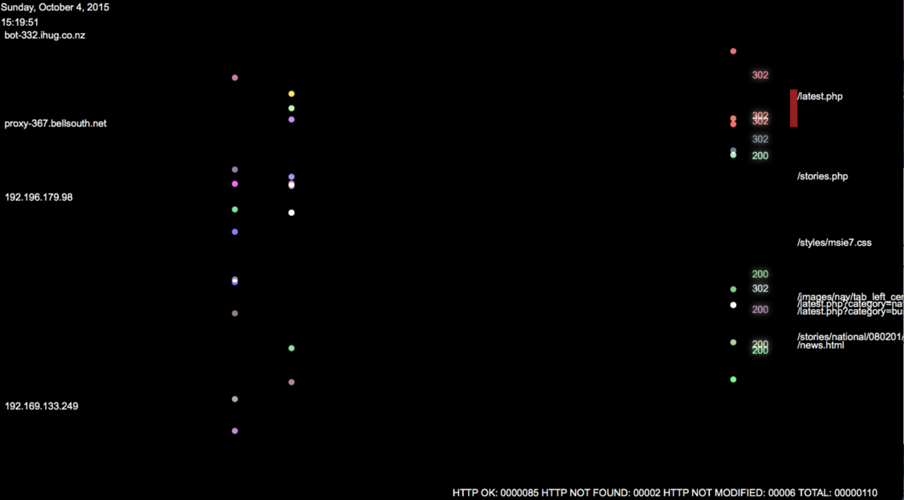

collect-stream-logs
===================

1. Ingest logs from folders.
2. Listen for syslogs on UDP port.
3. Merge syslogs and drop-in logs and persist them to Solr for historical search. 
4. Stream real-time log events and cross-filter historical logs on dashboard. 

### Demo

### Reference 
1. [Collecting Logs with Apache NiFi](http://bryanbende.com/development/2015/05/17/collecting-logs-with-apache-nifi/)