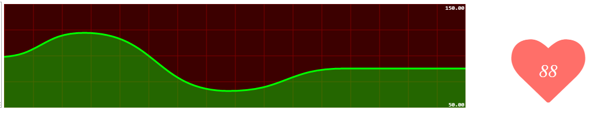
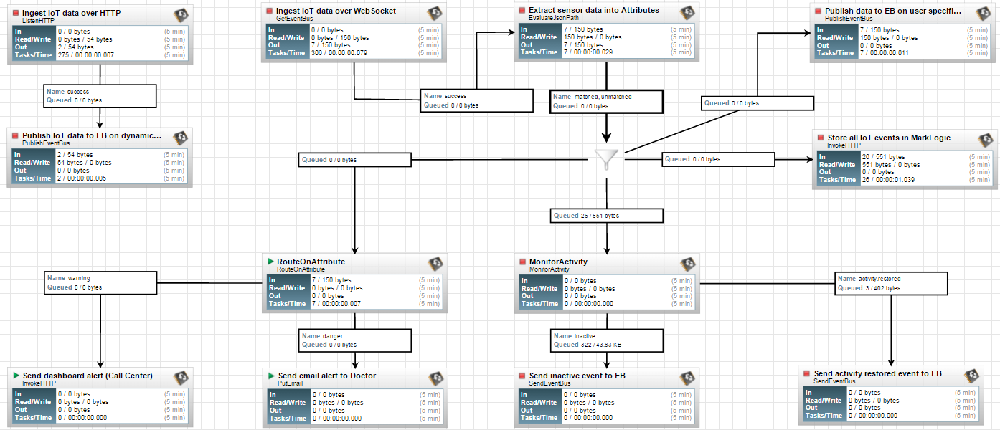

iot-activity-tracker
====================

1. Ingest IoT data over HTTP
    1. Open HTTP server on port 5001 and listen for HTTP `POST` requests.
    2. Add HTTP headers (`sensor`) to flowFile attributes. 
    2. Publish HTTP payload to **EventBus**'s dynamic address `iot.in.${sensor}`.
2. Ingest IoT data over WebSocket.
    1. Open EventBus-WebSocket bridge on port 5555.
    2. Let external (JavaScript), and internal(ListenHTTP) clients to publish IoT events including headers(`sensor`) to dynamic address `iot.in.${sensor}`.
    3. Extract sensor data from JSON payload into flowFile attributes for future use.
3. Store all data to HDFS(W.I.P) and summary data to NoSQL(MarkLogic) for historical data search.
4. Stream real-time targeted data to user's app and physicians dashboard. 
5. Route Heart rate IoT data to `warning` and `danger` routes
    1. `danger` route will send email alert to Physicians.
    2. `warning` route will send dashboard alert (Call Center).
6. Inactivity Reporting
    1. Send `Inactivity Message` when there is no IoT data in the flow for 5 min.
    2. Send `Activity Restored Message` when new IoT data received after inactivity event. 
    3. Client UI can subscript to `Inactivity` events and show graphical status. 
       
Note: this flow depends on **nifi-websocket** module, download [nar](https://github.com/xmlking/nifi-websocket/releases/download/0.1.0/nifi-websocket-0.1.0-SNAPSHOT.nar) and copy to `$NIFI_HOME/lib`

### Run
1. Send test IoT data via dashboard 
    > Access [this](./dashboard/heartrate.html) page and submit the form. 
2. Send test IoT data via CURL
```bash
curl ....
```

### Demo


### Flow


### Reference 
